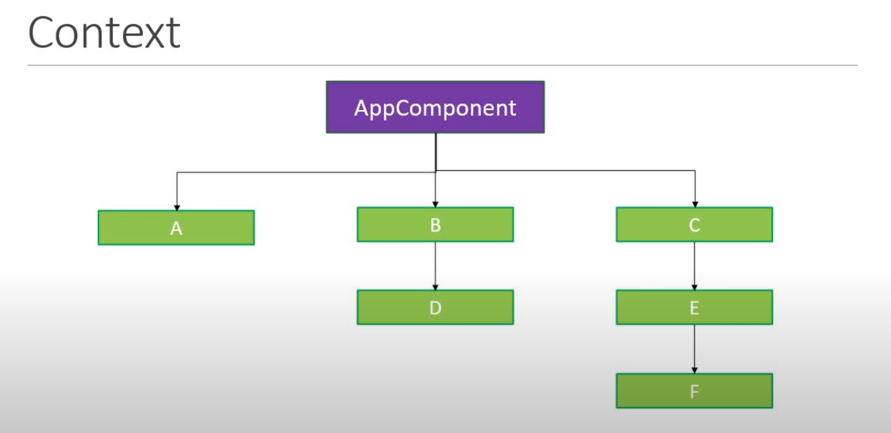

# useContext Hook

    

## useContext Hook ci consente di passare dati attraverso l'albero dei componenti senza passare manualmente le props
## Il passaggio di proprietà tra i componenti risulta particolarmente complicato nel caso di componenti nidificati, avendo una proprietà nel componente AppComponent per poterla passare al componente D dobbiamo farlo attraverso il componente B, cos' anche per il componente F, bisognerà trasmettere la proprietà prima al componente C, poi al compoenente E e successivamente al componente F, immagina di avere 100 componenti. Il tutto diventa poco chiaro e mantenibile, utiliziamo hook useContext per risolvere questo problema tra familiarità di componenti
