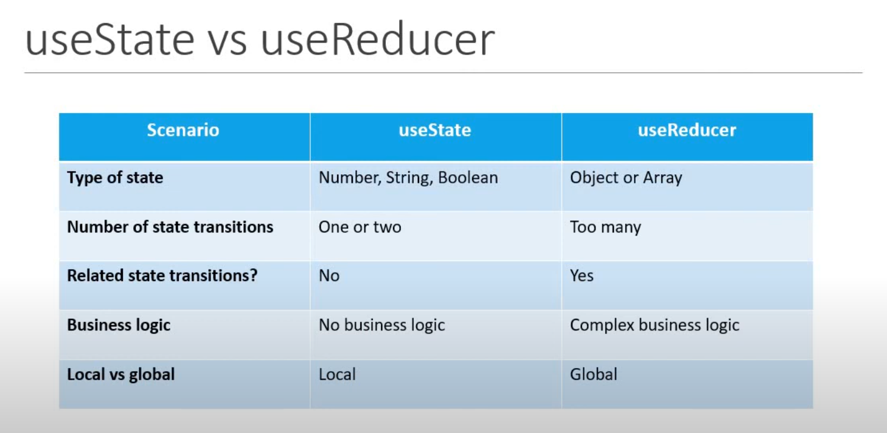

## useState VS useReducer

    

### Questi due Hooks ci aiutano a creare e mantenere uno stato, ma quando usare uno o l'altro?

<ul
    <li><h3>1. Chi gestisce meglio il tuo stato</h3></li>
    <ul>
        <li>
            La prima domanda da porsi è chi dei due hooks gestisce meglio il mio stato, ma per essere corretti 
            entrambi possono ti farranno arrivare allo stesso risultato, quindi bisogna chiedersi... 
            Quale dei due mi facilita la gestione dello stato?
            Se il tuo stato è un numero, uno stringa o semplicemente un booleano potrai fare tutto tramite useState,
            la sua semplicità e capacità di settare lo stato da una callback farà sicuramente al caso tuo,
            diverso il discordo per array e oggetti soprattutto se di grandi dimensioni, useReducer ti permettara di
            gestire i tuoi dati attraverso il reducer gestendo sempre gli action type al suo interno.
            Non dimenticare l'utilizzo dello spread operator, essenziale per gestire oggetti e array di grandi dimensioni
        </li>
     </ul>
</ul>

<ul
    <li><h3>2. Poche transizioni o tante transizioni?</h3></li>
    <ul>
        <li>
            useState gestendo dati primitivi è più indicato per uno stato che ricevrà poche transizioni, 
            ma soprattutto semplici. Uno semplice componente visualizzato tramite uno stato true o false
            è gestibile perfettamente da useState. Nel caso di diverse transizioni o comunque transizioni che modellano 
            lo stato in modo parziale, per esempio la chiave di un oggetto, è preferibile l'utilizzo di useReducer.
        </li>
     </ul>
</ul>

<ul
    <li><h3>3. Che tipo di relazioni hanno le transizioni dello stato?</h3></li>
    <ul>
        <li>
            Abbiamo visto come uno stato può avere una determinata modellazione a seconda del tipo di transizione.
	    Per esempio la gestione di una chiamata api avrà al suo interno diverse transizioni, come una fase di loading 
	    seguita da una fase in cui otteremo dei dati da passare allo stato oppure un errore. 
	    useReducer ci consente di gestire tutti questi casi nel reducer, questò lo renderà molto più mantenibile nel 
	    tempo a differenza di useState dove dovremmo mettere mano a diverse parti del codice.
        </li>
     </ul>
</ul>

<ul
    <li><h3>4. Valutazione della logica all'interno dello stato</h3></li>
    <ul>
        <li>
            Bisogna valutare bene il tipo di manipolazione che faremo sullo stato, questo ci porterà a fare la scelta migliore
	    tra useState e useReducer. Se il tuo stato richiede una business logic elevata, diverse trasformazioni e manipolazioni
	    dello stato la scelta deve ricaredere su useReducer, al contrario utilizza useState.
        </li>
     </ul>
</ul>

<ul
    <li><h3>5. Stato locale o globale</h3></li>
    <ul>
        <li>
            Se vuoi mantenere lo stato in locale nel componente stesso, useState è sempre la scelta migliore.
	    useReducer, utilizzato insieme ad un context, risulta molto più mantenibile se utilizzato a livello globale.
	    useState risulta particolarmente complicato a livello globale perchè deve passare molteplici funzioni di aggiornamento,
	    a differenza di useReducer che richiama sempre un dispatch sulle actions impostate.
        </li>
     </ul>
</ul>