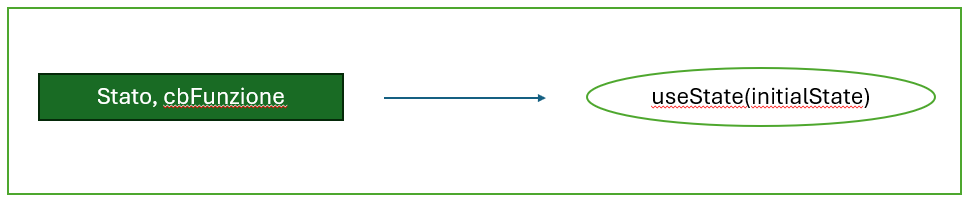

# useState Hook

### useState Hook ci consente di avere una variabile di stato in un componente funzionale
### A differenza delle classi, dove lo stato è sempre un oggetto, uno stato all'interno di un componente funzionale puà avere altri tipi di valore
### useState Hook ritorna sempre due elementi, il primo elemento è il valore corrente mentre il secondo elemento è una funzione per settare lo stato e aggiornarlo

    

### Quando aggiorno uno stato in un componente funzionale tramite la sua cb causo sempre un nuovo rendering del componente, ricostruendolo e visualizzando il nuovo valore
### Quando il nuovo valore dipende dal vecchio valore, posso passare una funzione di cb per richiamare il setter dello state
### La funzione di cb riceve un parametro che è lo stato non ancora aggiornato, per convenzione viene utilizzato la key "prev" 
### Ricorda sempre che per aggiornare oggetti e array che dipendono dal valore precedente posso utilizzare lo spread operator, più info [quì](https://www.w3schools.com/react/react_es6_spread.asp)

Documentazione ufficiale:
- [useState](https://react.dev/reference/react/useState)
