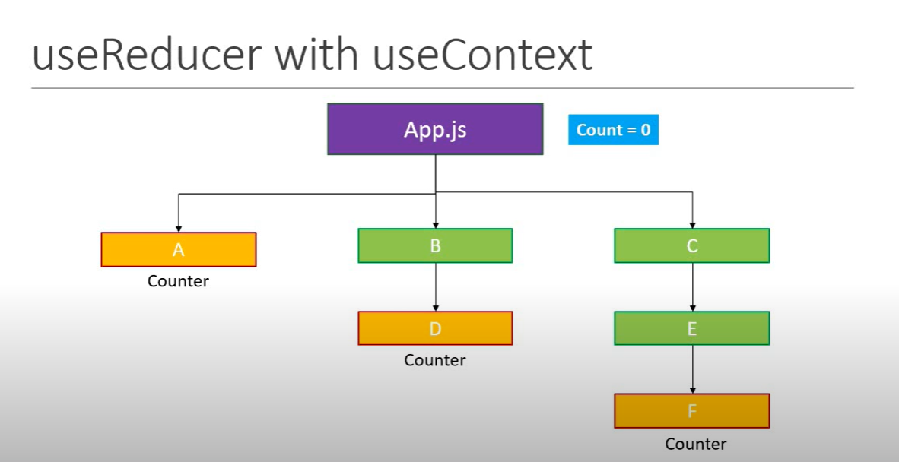

## useContext Hook & useReducer Hook

    

<ul
    <li><h3>1. Perchè utilizzare useContext insieme ad useReducer</h3></li>
    <ul>
        <li>
            La creazione di diversi componenti all'interno della nostra applicazione ci permette di mantenere il nostro lavoro
           mantenibile nel tempo. La possibilità di peter passare proprietà attraverso i vari componenti risulta molto utile
           per poter tenere il nostro codice in ordine, ma sempre mantendo un approcio di familiarità.
           Questo ci pone di fronte al concetto di scalabilità
        </li>
     </ul>
</ul>

<ul
    <li><h3>2. Utilizzo di useReducer sfruttando useContext</h3></li>
    <ul>
        <li>
            useReducer, come già visto, ci da la possibilità di creare uno stato all'interno di un componente controllabile
           e mantenibile in un'unica soluzione utilizzando e richiamando semplicemente un dispatch all'interno del componente.
           Pensa alla possibilità di condividere queste funzionalità in tutta l'applicazione.
           Passare delle semplici proprietà dal componente A al componente B o C risulta piuttosto semplice,
           ma se questi componenti
           risultassero centinaia di componenti? Semplice, utiliziamo un context!
        </li>
     </ul>
</ul>

<ul
    <li><h3>3. L'importanza di un context per espandere useReducer</h3></li>
    <ul>
        <li>
            Quando creiamo un context all'interno di un componente padre, possiamo condividerlo grazie al provider
            all'interno dell'applicazione. Questo fa in modo che tutti i componenti che stanno sotto di esso abbiano accesso
            a quelle proprietà. 
        </li>
     </ul>
</ul>

Documentazione ufficiale:
- [useReducer](https://react.dev/reference/react/useReducer)
- [useContext](https://react.dev/reference/react/useContext)
