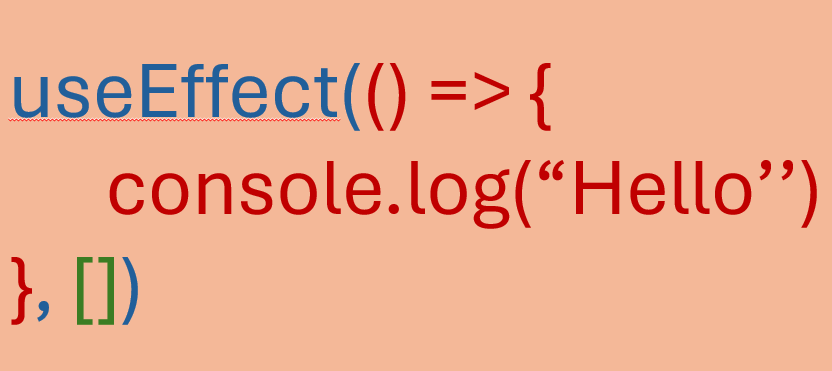

# useEffect Hook

### useEffect Hook ci consente di eseguire operazioni sul ciclo di vita del componente 
### In precedenza con i class components era richiesto il controllo del componente attraverso la scrittura di diversi metodi. Questo rendeva il codice ripetitivo e complesso

    

### useEffect è una buona soluzione per gestire le fasi di montaggio, smontaggio e aggiornamento dello stesso componente
### il suo utilizzo risulta abbastanza semplice ed è composto da una cb come primo parametro e una lista di dipendenze opzionale come secondo parametro
### il primo parametro obbligatorio è una funzione che verrà richiamata ad ogni rendering del componente, o comunque a seconda dell'impostazione del secondo parametro
### il secondo parametro, anche se opzionale, è di notevole importanza ed è ciò che rende questo hook super utilizzato ed importante. Infatti in questo parametro andiamo a specificare tutte le dipendenze che richiameranno la 
nostra cb, ad esempio una valore di stato. Se questo parametro viene specificato ma lasciato vuoto andiamo ad eseguire la cb solamente al primo rendering del componente per esempio quando dobbiamo effettuare una chiamata Api, al contrario se non specificato essendo opzionale la cb verrà richiamata ad ogni rendering a prescindere da qualsiasi cambiamento all'interno del componente.

    

Documentazione ufficiale:
- [useEffect](https://react.dev/reference/react/useEffect)
