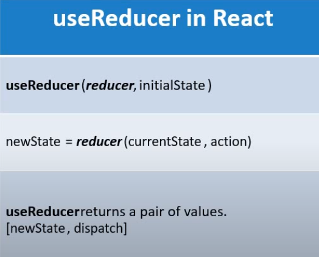
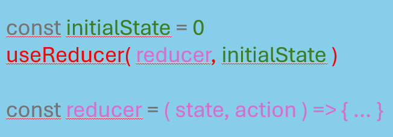

## useReducer Hook

### useReducer Hook per la gestione di uno stato 
### anche avendo già useState per la gestione di uno stato, useReducer risulta una valida alternativa
#### Curiosità: lo sapevi che useState è stato costruito dietro le quinte tramite useReducer, infatti esso utilizza il concetto di reducer, un argomento trattato a parte da React è molto importante per la gestione di uno stato.

    

<ul
    <li><h3>1. Composizione di useReducer</h3></li>
    <ul>
        <li>
            useReducer è composto da due parametri, un metodo di reducer e uno stato iniziale. 
        </li>
     </ul>
   <li><h3>2. Parametri di useReducer</h3></li>
    <ul>
        <li>
            Con il metodo reducer che andremo a costruire specifichiamo due parametri: uno stato corrente e delle actions che andranno a modificare il nostro stato, per ora pensa a delle azioni che determinato il tipo di transizione tra 
            lo stato attuale al nuovo stato. Il reducer restituirà sempre uno nuovo stato con o senza modifiche a seconda delle actions.
            

                
            

        </li>
     </ul>
</ul>

