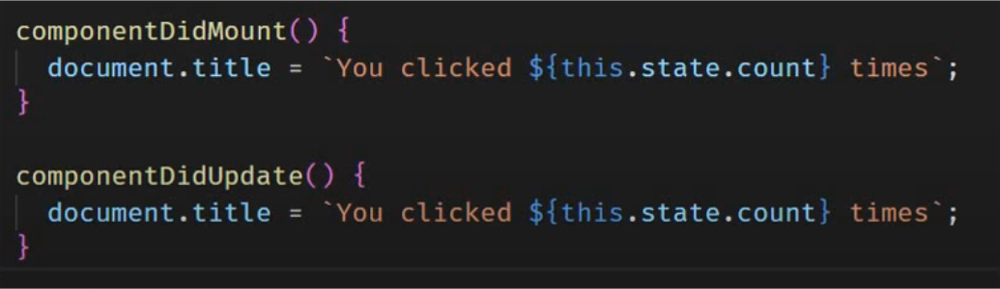

# useEffect Hook

### useEffect Hook ci consente di eseguire operazioni sul ciclo di vita del componente 
### In precedenza con i class components era richiesto il controllo del componente attraverso la scrittura di diversi metodi. Questo rendeva il codice ripetitivo e complesso

    

